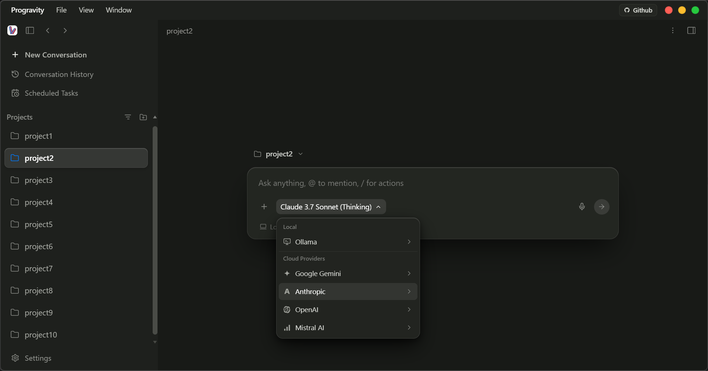
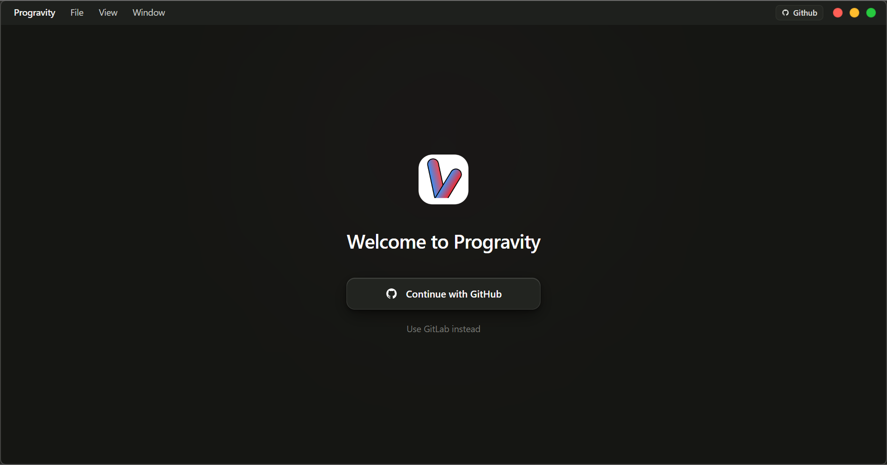
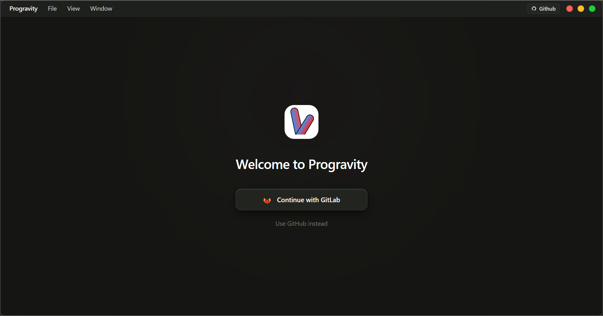
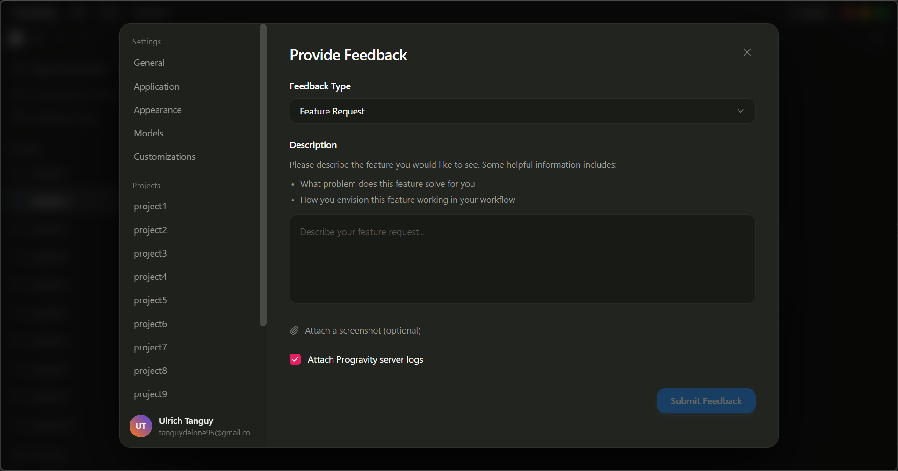
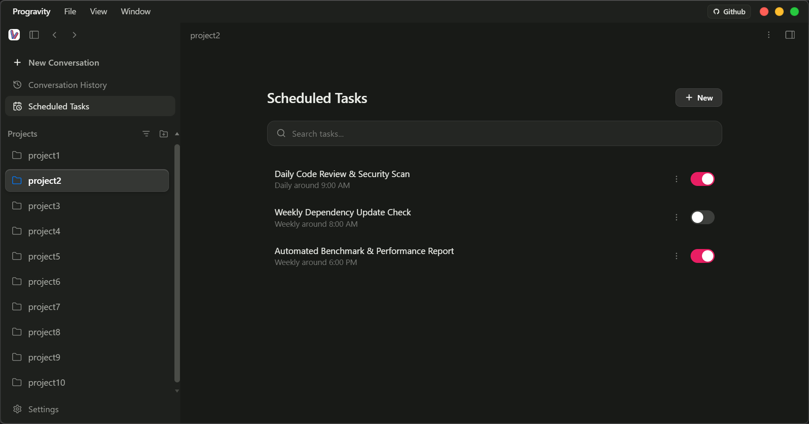

# Progravity Desktop UI

<div align="center">
  
  <p>An open-source desktop interface model inspired by Google Antigravity Desktop.</p>
</div>

## Overview

Progravity Desktop UI is a frontend interface template replicating the design patterns of Google Antigravity Desktop. Built with Electron, React, TypeScript, Vite, and Tailwind CSS, it provides a high-fidelity desktop experience with dark theme aesthetics, custom window management, and smooth interactions.

This repository serves as a standalone UI model and design showcase for developers looking to study or build desktop AI agent workspaces. [Preview here](.github/demo/progravity.mp4) 

---

## Features

- **Authentication and Onboarding**: Clean splash view supporting OAuth provider selection (GitHub, GitLab) with session persistence.
- **Unified Workspace and Prompt Area**: Central prompt interface with model picker, branch selector, and execution mode options.
- **Collapsible Sidebar**: Draggable project list, conversation histories, and quick navigation.
- **Spotlight Command Palette**: Keyboard-driven switcher accessible via `Ctrl+Shift+P` / `Cmd+Shift+P`.
- **Scheduled Tasks View**: Task management interface for recurring and one-time agent routines.
- **Settings Modal**: Full configuration modal covering General policies, Appearance themes, Model quotas, Customizations (Skills, Plugins), and Project-level overrides.

---

## Screenshots

### Main Workspace



### Authentication Views

<div align="center">
  
  
</div>

### Settings Modal



### Scheduled Tasks



---

## Getting Started

### Prerequisites

- Node.js (version 22 or higher)
- npm, pnpm, or yarn

### Installation

```bash
git clone https://github.com/tanguykonan/antigravity-clone.git
cd desktop-llm
npm install
```

### Development

Launch the desktop application in development mode with hot reload:

```bash
npm run dev
```

### Build

Compile the application for production:

```bash
npm run build
```

---

## License

This project is an independent UI reproduction created for educational and design reference purposes. It is distributed as-is under the [MIT License](LICENSE).